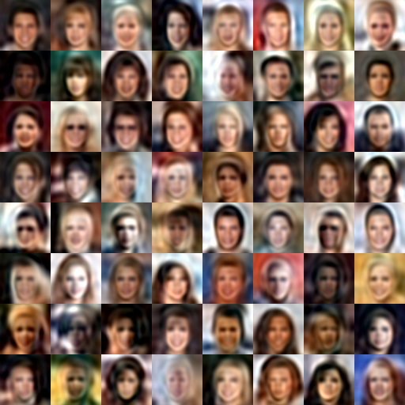

# gon_emb

Using fourier feature mapping Strengthen GON (《Gradient Origin Networks》)'s performance

## Introduction
 
The origin GON could quickly learn a latent representation by introducing a second-order derivative and SIREN.

It get a good performance on MNIST, but not good for Celeba:

|          Recon for Celeba           |
| :-----------------------: |
| |

As shown in the figure above, the recon is very blurry, and it's very easy to cause gradient explosion.
Which can be considered that it cannot learn high-frequency functions.

## Solution

As mentioned earlier, current models need a mechanism to learn high-frequency functions.
Fortunately, recently proposed [《Fourier Features Let Networks Learn
High Frequency Functions in Low Dimensional Domains》](https://arxiv.org/pdf/2006.10739.pdf) Just do it.

Simply apply fourier mapping on coordinates, let's see the result:

|          Recon for Celeba after apply fourier            |
| :-----------------------: |
| |

Wow! Considerable improvement!

## Conclusion

The appearance of SIREN makes it possible to calculate the second derivative, 
so the emergence of GON is natural. 
It's a good way to learning image embedding, 
and could be used with Image retrieval, face recognition, and so on.
But calculation speed and memory footprint are still an issue.

